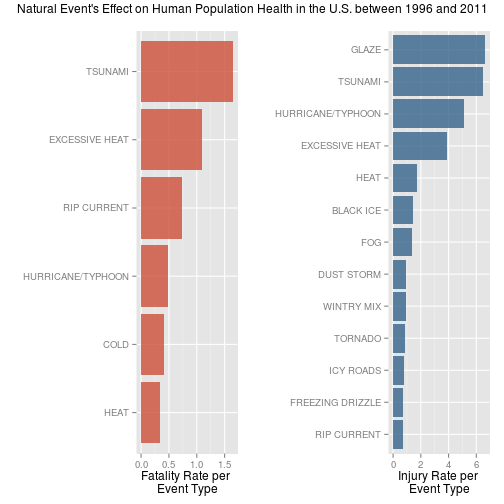

# Evaluation of NOAA Storm Database events from 1950 to 2011

## Synopsis

The Storms and other severe weather events can cause both public health and economic problems for communities and municipalities. Many severe events can result in fatalities, injuries, and property damage, and preventing such outcomes to the extent possible is a key concern. This project involves exploring the U.S. National Oceanic and Atmospheric Administration's (NOAA) storm database. This database tracks characteristics of major storms and weather events in the United States, including when and where they occur, as well as estimates of any fatalities, injuries, and property damage.

## Data Processing

### Loading required libraries

The following libraries are used in this analysis:


```r
library(dplyr, quietly=T, verbose=F, warn.conflicts=F)
library(ggplot2)
library(gridExtra)
```


### Obtaining and loading the dataset

The dataset is here downloaded from the source and loaded into the *noaa* data frame. Only variables of interest for the analysis are loaded to reduce RAM memory use. Variable names are replaced by lowercase to comply with tidy data practices.


```r
if (!file.exists("data.bz2")) { 
    download.file("https://d396qusza40orc.cloudfront.net/repdata%2Fdata%2FStormData.csv.bz2", destfile = "data.bz2", method = "curl")
}

noaa <- read.csv(bzfile("data.bz2"))[, c("EVTYPE","BGN_DATE","FATALITIES","INJURIES","PROPDMG","PROPDMGEXP","CROPDMG","CROPDMGEXP")]
names(noaa) <- tolower(names(noaa))
```

### Subset by Year

As the events in the database start in the year 1950 and end in November 2011 and in the earlier years of the database there are generally fewer events recorded, most likely due to a lack of good records. 


```r
noaa$year <- as.numeric(format(as.Date(noaa$bgn_date, format="%m/%d/%Y %H:%M:%S"),"%Y"))
```

The variables describing the multiplier for the PROPDMG and CROPDMG variables, PROPDMGEXP and CROPDMGEXP, respectivelly, include unknown values not mentioned on the data documentation for the years prior to 1996:


```r
filter(noaa, year >= 1995) %>% select(propdmgexp) %>% unique()
```

```
##       propdmgexp
## 1               
## 5              B
## 12             M
## 13             K
## 15             m
## 728            +
## 2317           0
## 2360           5
## 4965           6
## 5069           ?
## 5322           4
## 5534           2
## 5900           3
## 11846          7
## 13301          H
## 18934          -
## 21156          1
## 21383          8
```

```r
filter(noaa, year >= 1995) %>% select(cropdmgexp) %>% unique()
```

```
##       cropdmgexp
## 1               
## 5              M
## 15             m
## 111            K
## 648            B
## 2169           ?
## 2280           0
## 3571           k
## 15484          2
```

The data from 1996 onwards only indicates known multipliers (“K” for thousands, “M” for millions, and “B” for billions.):

```r
filter(noaa, year >= 1996) %>% select(propdmgexp) %>% unique()
```

```
##        propdmgexp
## 1               K
## 6                
## 72              M
## 49321           B
## 639593          0
```

```r
filter(noaa, year >= 1996) %>% select(cropdmgexp) %>% unique()
```

```
##        cropdmgexp
## 1               K
## 2                
## 184             M
## 332770          B
```

The dataset will be subsetted to include only events recorded from 1996 to 2011, a period chosen based on the quality of event records, as previously described: 


```r
noaa <- noaa[noaa$year >= 1996, ]
```

### Formating Event Type List

The list of event types contain several event types that do not comply with the official storm data event type classification provided by the dataset's documentation. There are also typos and event names with leading and trailing spaces. In order to address this issue to a satisfactory level, some events were renamed so they could be grouped together.


```r
# initial count of event types after subset to data from year >1996
length(unique(noaa$evtype))
```

```
## [1] 516
```

```r
noaa$evtype <- toupper(noaa$evtype)                 #match capitalization
noaa$evtype <- gsub("  "," ",noaa$evtype)           #remove double spaces
noaa$evtype <- gsub("/"," ",noaa$evtype)            #replace slashes for spaces 
noaa$evtype <- sub("^\\s+|\\s+$","",noaa$evtype)    #remove leading and trailing spaces 

# count of event types after subset to data from year >1996 and string manipulation
length(unique(noaa$evtype))
```

```
## [1] 424
```

The dataset's documentation provides a list of official storm events (listed below):


```
##  [1] "ASTRONOMICAL LOW TIDE"    "AVALANCHE"               
##  [3] "BLIZZARD"                 "COASTAL FLOOD"           
##  [5] "COLD/WIND CHILL"          "DEBRIS FLOW"             
##  [7] "DENSE FOG"                "DENSE SMOKE"             
##  [9] "DROUGHT"                  "DUST DEVIL"              
## [11] "DUST STORM"               "EXCESSIVE HEAT"          
## [13] "EXTREME COLD/WIND CHILL"  "FLASH FLOOD"             
## [15] "FLOOD"                    "FROST/FREEZE"            
## [17] "FUNNEL CLOUD"             "FREEZING FOG"            
## [19] "HAIL"                     "HEAT"                    
## [21] "HEAVY RAIN"               "HEAVY SNOW"              
## [23] "HIGH SURF"                "HIGH WIND"               
## [25] "HURRICANE (TYPHOON)"      "ICE STORM"               
## [27] "LAKE-EFFECT SNOW"         "LAKESHORE FLOOD"         
## [29] "LIGHTNING"                "MARINE HAIL"             
## [31] "MARINE HIGH WIND"         "MARINE STRONG WIND"      
## [33] "MARINE THUNDERSTORM WIND" "RIP CURRENT"             
## [35] "SEICHE"                   "SLEET"                   
## [37] "STORM SURGE/TIDE"         "STRONG WIND"             
## [39] "THUNDERSTORM WIND"        "TORNADO"                 
## [41] "TROPICAL DEPRESSION"      "TROPICAL STORM"          
## [43] "TSUNAMI"                  "VOLCANIC ASH"            
## [45] "WATERSPOUT"               "WILDFIRE"                
## [47] "WINTER STORM"             "WINTER WEATHER"
```

The dataset contains several EVTYPEs that do not match the documentation's list of event tyes. For the purpose of this analysis, a few selected event types were corrected. Further corrections can be made to the dataset, however, understanding and grouping event types under each event category would be an extensive task and only the following were performed:


```r
noaa$evtype <- sub("THUNDERSTORM WIND","TSTM WIND",noaa$evtype)
noaa$evtype <- sub("WILD FOREST FIRE","WILDFIRE",noaa$evtype)
noaa$evtype <- sub("STRONG WINDS","STRONG WIND",noaa$evtype)
noaa$evtype <- sub("RIP CURRENTS","RIP CURRENT",noaa$evtype)
noaa$evtype <- sub("MARINE TSTM WIND","MARINE THUNDERSTORM WIND",noaa$evtype)
noaa$evtype <- sub("WINTER WEATHER MIX","WINTER WEATHER",noaa$evtype)
noaa$evtype <- sub("COASTAL FLOODING","COASTAL FLOOD",noaa$evtype)
noaa$evtype <- sub("HURRICANE","HURRICANE/TYPHOON",noaa$evtype) 
noaa$evtype <- sub("HURRICANE/TYPHOON TYPHOON","HURRICANE/TYPHOON",noaa$evtype) 
noaa$evtype <- sub("URBAN SML STREAM FLD","FLOOD",noaa$evtype)
noaa$evtype <- sub("LANDSLIDE","AVALANCHE",noaa$evtype) # (leaves 413)

# count of event types after subset to data from year >1996, string manipulation and matching selected names/categories
length(unique(noaa$evtype))
```

```
## [1] 413
```

Besides the above, from the remaining 413 event types, it's relevant to mention that 359 list zero injuries, fatalities, crop damage and property damage. Removing or not those event types will not influence the result of this analysis.


```r
nothing <- filter(noaa, fatalities == 0 & injuries == 0 & cropdmg == 0 & propdmg == 0)
length(unique(nothing$evtype))  # number of unique events types without any reported variables of interest
```

```
## [1] 359
```


### Obtaining variables of interest via getevents() function

The custom *getevents()* function fetches and sorts in descending order (from higher to lower) the values of a given variable of interest, such as fatalities or injuries counts.


```r
getevents <- function(evtypename, data = noaa, arrangeby = "value") {
      result <- eval(substitute(evtypename),data,parent.frame())
      result <- aggregate(result,list(noaa$evtype), sum) 
      names(result) <- c("evtype","value")
      
      # calculate rates
      frequencies <- data.frame(table(noaa$evtype))
      names(frequencies) <- c("evtype","evtotalcount")
      result <- merge(result, frequencies, by="evtype")
      result$evrate <- result[,2] / result$evtotalcount
      
      # arrange based on "arrangeby" argument and rename variables
      if (arrangeby == "value") { result <- arrange(result, desc(value)) }
      else { result <- arrange(result, desc(evrate)) }
      names(result) <- c("evtype",substitute(evtypename),"evcount","evrate")
      result
}
```

In addition to the absolute count, the *getevents()* function also calculates the the givens variable rate based on the frequency of each event type. When the *arrangeby* argument is defined as *evrate*, the event rate is calculated by the total amount of values (e.g. total amount of fatalities due to flooding) per number of occurences of an event type (e.g. total number of floods).


### Calculating US Dollar amounts for crop and property damage via getdollar() function

The property and crop damage values presented on the PROPDMG and CROPDMG are calculated based on the respective -EXP variable via the *getdollar()* function. Two new variables are added to the dataset, indicating the damage value is US dollars.


```r
getdollar <- function(amount,m) {
    if(m == "B") { mexp <- 9 }
    else if(m == "M") { mexp <- 6 }
    else if(m == "K") { mexp <- 3 }
    else if(m == "H") { mexp <- 2 }
    else if(m == "?") { mexp <- 0 }
    else if(is.na(m)) { mexp <- 0 }
    else { mexp <- 0 }
    amount * 10^mexp
}
noaa$cropdmgdolar <- mapply(getdollar,noaa$cropdmg, noaa$cropdmgexp)
noaa$propdmgdolar <- mapply(getdollar,noaa$propdmg, noaa$propdmgexp)
```


## Results

### Which types of events are most harmful with respect to population health?

The effect on the human population health is estimated here by the number of fatalities and number of injuries. For those two specific variables, the top 20 event types with that have impacted a larger population are as follows:


```r
select(getevents(fatalities),evtype,fatalities)[1:20,]
```

```
##                     evtype fatalities
## 1           EXCESSIVE HEAT       1797
## 2                  TORNADO       1511
## 3              FLASH FLOOD        887
## 4                LIGHTNING        651
## 5              RIP CURRENT        542
## 6                    FLOOD        442
## 7                TSTM WIND        371
## 8                AVALANCHE        260
## 9                     HEAT        237
## 10               HIGH WIND        235
## 11            WINTER STORM        191
## 12 EXTREME COLD WIND CHILL        125
## 13       HURRICANE/TYPHOON        125
## 14            EXTREME COLD        115
## 15             STRONG WIND        110
## 16              HEAVY SNOW        107
## 17         COLD WIND CHILL         95
## 18              HEAVY RAIN         94
## 19               HIGH SURF         90
## 20                WILDFIRE         87
```


```r
select(getevents(injuries),evtype,injuries)[1:20,]
```

```
##               evtype injuries
## 1            TORNADO    20667
## 2              FLOOD     6837
## 3     EXCESSIVE HEAT     6391
## 4          TSTM WIND     5029
## 5          LIGHTNING     4141
## 6        FLASH FLOOD     1674
## 7           WILDFIRE     1456
## 8  HURRICANE/TYPHOON     1321
## 9       WINTER STORM     1292
## 10              HEAT     1222
## 11         HIGH WIND     1083
## 12              HAIL      713
## 13               FOG      712
## 14        HEAVY SNOW      698
## 15       RIP CURRENT      503
## 16    WINTER WEATHER      483
## 17          BLIZZARD      385
## 18        DUST STORM      376
## 19    TROPICAL STORM      338
## 20         ICE STORM      318
```


```r
plotfat <- ggplot(getevents(fatalities,arrangeby="value")[1:20,], aes(x=reorder(evtype,fatalities), y=fatalities)) +
    geom_bar(stat="identity", fill="tomato", alpha=.8) +
    coord_flip() + theme(legend.position="none", axis.text.x = element_text(angle = 90, hjust = 1)) +
    labs(y = "Number of Fatalities", x = "Event Type")

plotinj <- ggplot(getevents(injuries,arrangeby="value")[1:20,], aes(x=reorder(evtype,injuries), y=injuries)) +
    geom_bar(stat="identity", fill="steelblue2", alpha=.8) +
    coord_flip() + theme(legend.position="none", axis.text.x = element_text(angle = 90, hjust = 1)) +
    labs(y = "Number of Injuries", x = "")

grid.arrange(plotfat, plotinj, ncol = 2, top="Natural Event's Effect on Human Population Health in the U.S. between 1996 and 2011")
```

 

Alternatively, one may evaluate the harmfulness of an event type by the rate of fatalities or injuries it may cause. Here are the top ranking harmful event types ranked by the rate of fatalities and injuries they have caused, limited to events with at least 10 occurences and with a average rate of at least 0.3 for fatalities and 0.5 injuries per event record.


```r
ratefat <- filter(getevents(fatalities,arrangeby="evrate"), evcount > 10) %>% 
    select(evtype,evrate) %>% 
    filter(evrate > 0.3)
ratefat
```

```
##              evtype    evrate
## 1           TSUNAMI 1.6500000
## 2    EXCESSIVE HEAT 1.0851449
## 3       RIP CURRENT 0.7384196
## 4 HURRICANE/TYPHOON 0.4844961
## 5              COLD 0.4090909
## 6              HEAT 0.3310056
```


```r
rateinj <- filter(getevents(injuries,arrangeby="evrate"), evcount > 10) %>% 
    select(evtype,evrate) %>% 
    filter(evrate > 0.5)
rateinj
```

```
##               evtype    evrate
## 1              GLAZE 6.6250000
## 2            TSUNAMI 6.4500000
## 3  HURRICANE/TYPHOON 5.1201550
## 4     EXCESSIVE HEAT 3.8592995
## 5               HEAT 1.7067039
## 6          BLACK ICE 1.4117647
## 7                FOG 1.3383459
## 8         DUST STORM 0.9016787
## 9         WINTRY MIX 0.8953488
## 10           TORNADO 0.8925888
## 11         ICY ROADS 0.7857143
## 12  FREEZING DRIZZLE 0.7222222
## 13       RIP CURRENT 0.6852861
```


```r
plotprop <- ggplot(ratefat, aes(x=reorder(evtype,evrate), y=evrate)) +
    geom_bar(stat="identity", fill="tomato3", alpha=.8) +
    coord_flip() + theme(legend.position="none") +
    labs(y = "Fatality Rate per \nEvent Type", x = "") 

plotcrop <- ggplot(rateinj, aes(x=reorder(evtype,evrate), y=evrate)) +
    geom_bar(stat="identity", fill="steelblue4", alpha=.8) +
    coord_flip() + theme(legend.position="none") +
    labs(y = "Injury Rate per \nEvent Type", x = "")

grid.arrange(plotprop, plotcrop, ncol = 2, top="Natural Event's Effect on Human Population Health in the U.S. between 1996 and 2011")
```

 

The analysis of these rates compared to the absolute total fatalities and injuries (previous graph) indicates that a tsunamis have a higher fatality rate than excessive heat, which ranked first in number of fatalities. In other words, althougt not having caused the most total deaths, tsunamis are the deadliest event on the dataset: each recorded tsunami (33 tsunamis total) caused the death of 1.65 people (20 fatalities total).


### Which types of events have the greatest economic consequences?

The economic impact is estimated here by property and crop damages, in US dollars.


```r
select(getevents(propdmgdolar),evtype,propdmgdolar)[1:20,]
```

```
##               evtype propdmgdolar
## 1              FLOOD 144003143200
## 2  HURRICANE/TYPHOON  81118659010
## 3        STORM SURGE  43193536000
## 4            TORNADO  24616945710
## 5        FLASH FLOOD  15222253910
## 6               HAIL  14595143420
## 7          TSTM WIND   7868810880
## 8           WILDFIRE   7760449500
## 9     TROPICAL STORM   7642475550
## 10         HIGH WIND   5247860360
## 11  STORM SURGE TIDE   4641188000
## 12         ICE STORM   3642248810
## 13      WINTER STORM   1532743250
## 14           DROUGHT   1046101000
## 15         LIGHTNING    743077080
## 16        HEAVY SNOW    634417540
## 17           TYPHOON    600230000
## 18        HEAVY RAIN    584864440
## 19          BLIZZARD    525658950
## 20     COASTAL FLOOD    355209560
```


```r
select(getevents(cropdmgdolar),evtype,cropdmgdolar)[1:20,]
```

```
##               evtype cropdmgdolar
## 1            DROUGHT  13367566000
## 2  HURRICANE/TYPHOON   5349282800
## 3              FLOOD   4983266500
## 4               HAIL   2476029450
## 5        FLASH FLOOD   1334901700
## 6       EXTREME COLD   1308973000
## 7       FROST FREEZE   1094186000
## 8          TSTM WIND    952246350
## 9         HEAVY RAIN    728169800
## 10    TROPICAL STORM    677711000
## 11         HIGH WIND    633561300
## 12    EXCESSIVE HEAT    492402000
## 13          WILDFIRE    402255130
## 14           TORNADO    283425010
## 15            FREEZE    156725000
## 16        HEAVY SNOW     71122100
## 17       STRONG WIND     64953500
## 18    TSTM WIND HAIL     64696250
## 19       EARLY FROST     42000000
## 20   DAMAGING FREEZE     34130000
```


```r
plotprop <- ggplot(getevents(propdmgdolar,arrangeby="value")[1:20,], aes(x=reorder(evtype,propdmgdolar), y=propdmgdolar)) +
    geom_bar(stat="identity", fill="slategray3", alpha=.8) +
    coord_flip() + theme(legend.position="none", axis.text.x = element_text(angle = 90, hjust = 1)) +
    labs(y = "Property Damage \n Cost in US Dollars", x = "") + scale_y_sqrt()

plotcrop <- ggplot(getevents(cropdmgdolar,arrangeby="value")[1:20,], aes(x=reorder(evtype,cropdmgdolar), y=cropdmgdolar)) +
    geom_bar(stat="identity", fill="olivedrab4", alpha=.8) +
    coord_flip() + theme(legend.position="none", axis.text.x = element_text(angle = 90, hjust = 1)) +
    labs(y = "Crop Damage \n Cost in US Dollars", x = "") + scale_y_sqrt()

grid.arrange(plotprop, plotcrop, ncol = 2, top="Natural Event's Economical Impact in the U.S. between 1996 and 2011 \n (square root scale)")
```

 

Floods and hurricanes/typhoons are responsible for the largest economical impact on properties. Droughts and hurricane/typhoons are responsible for the largest economical impact on crops.
